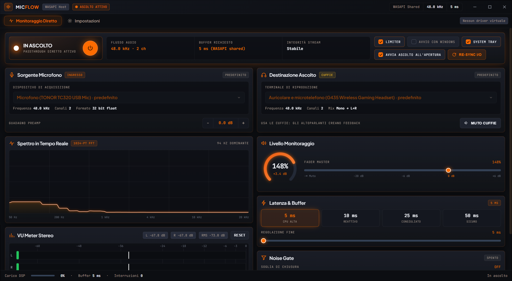

# Mic Flow

App Windows per **ascoltare il proprio microfono in tempo reale** nelle cuffie,
con metering completo: spettro FFT, VU stereo true-peak, noise gate e limiter.

Un solo `.exe`, nessuna installazione, **nessun driver audio virtuale**.



## Perché non peggiora l'audio che sentono gli altri

Le app di voice changing installano un **driver audio virtuale**: tutti i programmi
(Discord, giochi, OBS) passano attraverso quel driver, quindi qualità e carico CPU
dipendono da lui, anche quando non stai usando nessun effetto.

Mic Flow non installa niente. Apre il microfono in **WASAPI shared mode** e manda il
segnale all'uscita scelta. Discord e gli altri programmi continuano a leggere il
microfono reale, esattamente come quando l'app è chiusa. Shared mode è una scelta
precisa: la modalità esclusiva darebbe qualche millisecondo in meno ma **toglierebbe
il microfono a tutti gli altri programmi**.

## Download e utilizzo

Scarica lo zip dalla pagina [Releases](../../releases), poi:

1. Tasto destro sullo zip → **Proprietà** → spunta **Annulla blocco** → OK.
   Windows marchia i file scaricati da internet; togliendo il blocco qui
   SmartScreen non avvisa sull'exe estratto.
2. Estrai `MicMonitor.exe` dove vuoi ed eseguilo.
   Se salti il passo 1 compare *"Windows ha protetto il PC"*: è normale per un
   programma senza firma digitale — **Ulteriori informazioni** → **Esegui comunque**.
3. Scegli **Sorgente** (il microfono) e **Destinazione** (dove ascoltare).
   **Usa le cuffie**: con gli altoparlanti si innesca il fischio da feedback.
4. Premi il pulsante di accensione.

## Cosa fa ogni comando

| Comando | Effetto |
|---|---|
| Pulsante di accensione | Avvia e ferma il passthrough. |
| Guadagno preamp `−` / `+` | Guadagno d'ingresso in dB (−20 … +30). Non tocca il livello che sentono gli altri. |
| Fader master | Volume di ascolto 0–200 %, solo nelle tue cuffie. |
| Muto cuffie | Silenzia l'ascolto lasciando il motore attivo. |
| Latenza & buffer | Preset 5 / 10 / 25 / 50 ms più regolazione fine 5–120 ms. Cambiarla ricrea i client WASAPI. |
| Noise gate | Soglia −70 … −25 dB, attacco 3 ms, rilascio 120 ms. La riduzione applicata è mostrata in tempo reale. |
| Limiter | Limitatore soft sui picchi al posto del taglio netto. |
| Re-sync I/O | Rilegge l'elenco dei dispositivi audio. |
| Avvio con Windows | Voce in `HKCU\...\Run`, parte direttamente nell'area di notifica. |
| System tray | Chiudendo con la X l'ascolto continua in background invece di uscire. |
| Avvia ascolto all'apertura | Fa partire il passthrough da solo. |

### Strumenti di misura

Tutti alimentati dal segnale reale del microfono, misurato **prima** del guadagno:

- **Spettro FFT** — 1024 punti, finestra di Hann, 72 bande logaritmiche da 40 Hz a 20 kHz, con lettura della frequenza dominante.
- **VU stereo** — picco per canale, RMS, peak-hold, correlazione di fase L/R e stima del rumore di fondo.
- **Carico DSP** — tempo speso nel callback di acquisizione rapportato alla durata del buffer.
- **Interruzioni** — quante volte la coda è stata svuotata per deriva tra i clock dei due dispositivi.

## Finestra

Ridimensionabile, con bordi trascinabili e gestione esplicita di `WM_DPICHANGED`:
spostandola su un monitor con scaling diverso la finestra viene riadattata alla
dimensione suggerita da Windows, senza bordi sfalsati. Testato passando tra un
monitor al 100 % e uno al 125 %.

Le impostazioni, posizione e dimensione comprese, stanno in `%APPDATA%\MicMonitor\settings.ini`.

## Requisiti

Windows 10 o 11 a 64 bit, con .NET Framework 4.x e **Microsoft Edge WebView2 Runtime**
(preinstallato su Windows 11 e sulla maggior parte dei Windows 10; altrimenti si scarica
gratis da Microsoft). L'interfaccia è una pagina HTML incorporata nell'eseguibile e
renderizzata da WebView2: è così che la grafica resta nitida a qualsiasi scaling.

## Come funziona

```
WasapiCapture (shared)
  ├─ misura L/R, RMS, correlazione, rumore di fondo
  ├─ finestra scorrevole 1024 campioni → FFT → 72 bande
  └─ BufferedWaveProvider          coda con protezione dal drift dei clock
       └─ MonoDownmixProvider      da N canali a mono
            └─ MonitorProcessor    guadagno, noise gate, limiter soft
                 └─ WdlResampling  solo se le frequenze non coincidono
                      └─ MonoSpread → WasapiOut (shared, event driven)
```

## Compilare

Non serve Visual Studio né il .NET SDK: si usa il compilatore C# incluso in Windows.

```powershell
git clone https://github.com/il-russo/MicMonitor.git
cd MicMonitor
.\build\fetch-naudio.ps1     # NAudio 1.10.0 da NuGet
.\build\fetch-webview2.ps1   # SDK WebView2 da NuGet
.\build\build.ps1            # produce MicMonitor.exe nella radice
```

`build.ps1` incorpora nell'eseguibile NAudio, le due DLL gestite di WebView2, il loader
nativo e la pagina HTML con i font in base64. Al primo avvio `WebView2Loader.dll` viene
estratto in `%LOCALAPPDATA%\MicMonitor\runtime`.

### Struttura

| Percorso | Contenuto |
|---|---|
| `src/MicMonitor.cs` | Host: finestra, motore audio, analisi del segnale, bridge JSON. |
| `ui/app.html` | L'interfaccia: HTML, CSS e canvas. Apribile nel browser, mostra dati finti per l'anteprima. |
| `ui/fonts/fonts.css` | Plus Jakarta Sans e JetBrains Mono in base64, per restare offline. |
| `design/DESIGN.md` | Design system "Solaris Audio Workstation": token, tipografia, componenti. |
| `build/build.ps1` | Compilazione completa. |
| `build/bundle-ui.ps1` | Inserisce i font dentro la pagina e produce `app.bundle.html`. |
| `build/make_icon.py` | Genera l'icona senza dipendenze (Python 3). |
| `build/EngineTest.cs` | Test da console della catena audio. |

## Licenza

MIT — vedi [LICENSE](LICENSE). Incorpora [NAudio](https://github.com/naudio/NAudio) 1.10.0 (MIT)
e il [WebView2 SDK](https://aka.ms/webview) di Microsoft.
